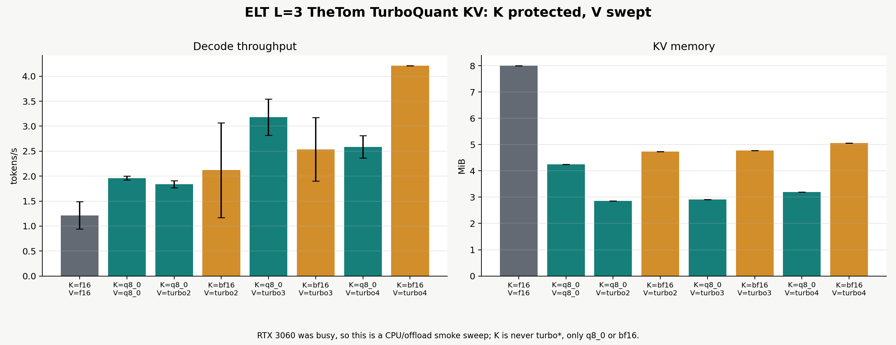
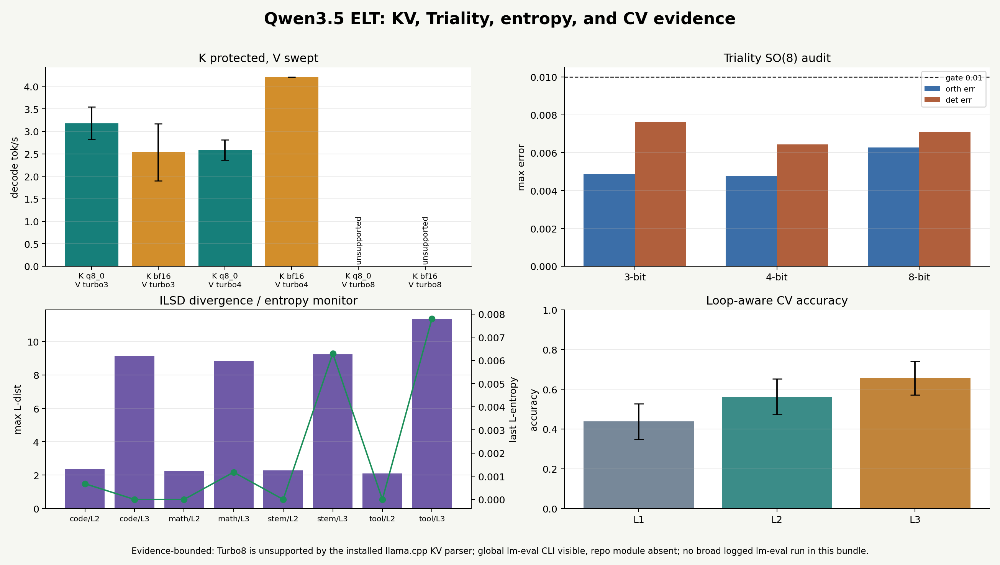
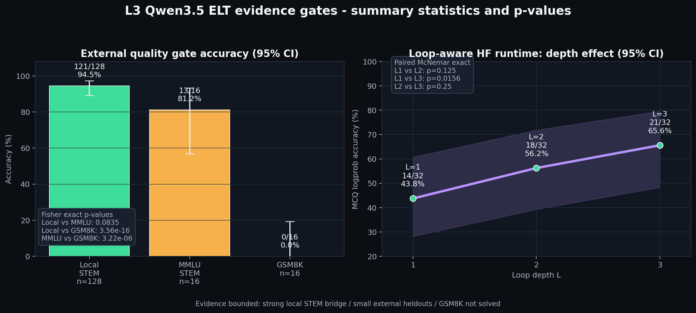
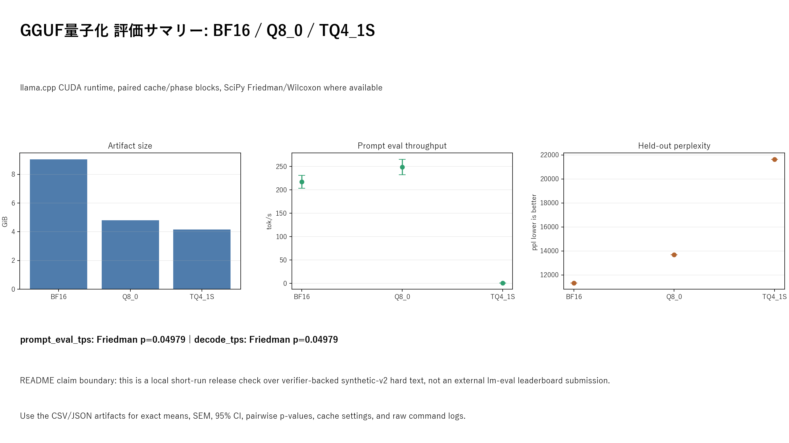

# elastic-looped-transformer


> **TL;DR** — A causal LM whose Transformer layers are **weight-shared across L
> iterations**. Pick `L ∈ [1, 4]` per request at inference to trade quality for
> latency — from the **same checkpoint**. Trained with **Intra-Loop
> Self-Distillation** + **GRPO** with a `correct × format` verifier. Scales
> shipped from 10M to **1 B non-embedding**, runnable on a single **RTX 3060 12 GB**
> via 8-bit paged or fp32-on-NVMe optimizer state. Faithful PyTorch port of
> **[arXiv:2604.09168](https://arxiv.org/abs/2604.09168)**.

---

## What's in the box

- **ELT core** (`src/elt_lm/`) — N shared Transformer layers iterated L times at
  inference. Paper equations preserved verbatim in code.
- **ILSD** — Intra-Loop Self-Distillation (`loss = L_GT(T) + λ L_GT(S) + (1−λ) L_dist(S, sg T)`)
  with `L_int ∼ U(L_min, L_max)` student, linear λ decay from 1 → 0.
- **GRPO** — DeepSeekMath §4.1 post-training with clipped surrogate + unbiased
  KL to frozen SFT reference. Verifier is `correct · format` with length +
  repeat guards. Python-exec verifier for code tasks.
- **Memory stack for 1 B on 12 GB VRAM** — two optimizer back-ends:
  - `paged_adamw_8bit` (bitsandbytes) — **peak 7.88 GB VRAM** on the 1 B config, fast.
  - `nvme_adamw` — custom 4-tier store with fp32 optimizer state **memory-mapped
    on NVMe**; params stay on GPU, state round-trips CPU→NVMe each step.
- **Rolling 5-minute checkpoints** — round-robin `rolling_{0..keep-1}.pt` +
  `last.pt` hardlink + CPU/CUDA RNG state → bit-reproducible resume.
- **HuggingFace Hub export** — `trust_remote_code=True` bundle (model code +
  weights + tokenizer + rendered README in one directory).
- **Streamlit dashboard** — live panels for pipeline / training / storage tiers
  / hardware / inference Pareto / checkpoints, fed by a line-buffered JSONL
  telemetry writer.

## Quickstart (use a published checkpoint)

```python
from transformers import AutoModelForCausalLM, AutoTokenizer
import torch

tok   = AutoTokenizer.from_pretrained("zapabob/elt-lm-base-275m")
model = AutoModelForCausalLM.from_pretrained(
    "zapabob/elt-lm-base-275m",
    trust_remote_code=True,
    torch_dtype=torch.bfloat16,
).eval().cuda()

ids = tok("If 3x + 7 = 22, what is x? Think step by step.",
          return_tensors="pt").input_ids.cuda()

# Same checkpoint, user picks L per call.
for L in (1, 2, 3, 4):
    out = model.generate(ids, max_new_tokens=128, L=L, do_sample=False)
    print(f"L={L}: {tok.decode(out[0], skip_special_tokens=True)}")
```

## Architecture

```
input_ids ──embed──► x₀ ──g_Θ──► x₁ ──g_Θ──► x₂ ── ... ──g_Θ──► x_L ──norm + lm_head──► logits
                       └─── weights SHARED across every iteration ───┘
```

| eq. | where | what |
|---|---|---|
| `g_Θ(x) = f_{θ_N} ∘ … ∘ f_{θ_1}(x)` | `src/elt_lm/composite.py` | composite block, N unique layers |
| `F_{N,L}(x) = g_Θ^L(x)` | `src/elt_lm/model.py` | L-fold iteration |
| `L_ILSD = L_GT(T) + λ L_GT(S) + (1−λ) L_dist(S, sg T)` | `src/elt_lm/losses.py` | intra-loop distillation (paper eq. 3) |
| `L_int ∼ U(L_min, L_max)` | `src/elt_lm/train.py` | stochastic student L |
| `λ: 1 → 0` (linear) | `src/elt_lm/train.py` | distillation curriculum |

## Shipped scales

| config | d_model | N | non-emb | total | effective (L=4) | target hardware |
|---|---|---|---|---|---|---|
| `tiny_10M.yaml` | 256 | 4 | 3.5 M | ~67 M | 16-layer | CPU smoke |
| `base_100M.yaml` | 768 | 12 | **85 M** | 275 M | 48-layer | 12 GB GPU, fp32 Adam |
| `smoke_300M.yaml` | 1024 | 16 | 205 M | 460 M | 64-layer | NvmeAdamW validation |
| `base_1B.yaml` | 1792 | 28 | **1.09 B** | 1.54 B | **112-layer** | 12 GB GPU w/ PagedAdamW8bit |

Token embedding (248 K × d_model) dominates the parameter count at smaller
scales; the interesting number is **non-emb**, which is what gets iterated.

## ILSD stability objective

ELT is evaluated as a loop-wise refinement system, not only as a small dense LM.
The teacher is the deepest loop and the student is an intermediate loop:

```text
z_T = logits at L_T = L_max
z_S = logits at L_S ~ U(L_min, L_max)
p_T = stopgrad(softmax(z_T / tau_T))
p_S = softmax(z_S)
L_ILSD = L_GT(T) + lambda L_GT(S) + (1 - lambda) CE(p_T, p_S)
```

The `stopgrad` on `p_T` is intentional. It prevents the deepest loop from being
pulled around by the student during self-distillation, keeping the maximum-loop
path as the local teacher. The current stabilizer stack keeps teacher-only
temperature and masked soft CE, then adds entropy/loop-trajectory regularizers
so additional loops refine rather than collapse:

- **teacher-only temperature** smooths the teacher target without hiding the
  student's actual sharpness.
- **entropy floor** penalizes low-entropy collapse when the model becomes
  confidently wrong.
- **Delta^2 entropy curvature** penalizes abrupt entropy bends along the loop
  axis `L`, matching the ELT idea of incremental refinement.
- **sampled Delta^2 logit curvature** can be enabled after entropy metrics are
  stable, using sampled/top-k vocab slices instead of full-vocab curvature.

The important design choice is that safety and capability alignment are handled
mostly by data selection, lane verifiers, KL-constrained GRPO, and evaluation
rather than by blanket refusal behavior baked into the base model.

## Anytime loop evaluation

The key experimental question is not merely whether `L=4` scores higher than
`L=1`, but whether deeper loops correct shallow mistakes without overthinking
correct answers. `elt-anytime` now emits benchmark refinement telemetry:

```text
loop_gain(L=k)       = score(L=k) - score(L=1)
marginal_gain(L=k)   = score(L=k) - score(L=k-1)
self_correction_rate = count(L=1 wrong and L=k correct) / N
overthinking_rate    = count(L=1 correct and L=k wrong) / N
```

For each benchmark, track these alongside per-loop accuracy, entropy trajectory,
latency/token, tokens/sec, and VRAM. A healthy ELT run should increase
self-correction faster than overthinking as `L` grows.

## 1 B training on a 12 GB card

```bash
uv run elt-train --config configs/base_1B.yaml
```

With `optim.kind: paged_adamw_8bit`:

| measure | value |
|---|---|
| model params | 1.537 B total, 1.092 B non-emb |
| **peak VRAM** | **7.88 GB** |
| one-step smoke | ~5.0 s (incl. cuDNN warm-up) |

Alternative — NVMe-backed fp32 state (`optim.kind: nvme_adamw`):

```yaml
# configs/your_run.yaml
optim:
  kind: nvme_adamw
offload:
  enabled: true
  root: H:/elt_data/offload_nvme  # where to mmap fp32 state shards
  min_free_gb: 20.0               # refuse to start if less
```

Measured on `smoke_300M.yaml` × NvmeAdamW, RTX 3060:

| measure | value |
|---|---|
| params | 0.46 B total, 0.21 B non-emb |
| peak VRAM | 4.38 GB |
| step (fwd + bwd + NvmeAdamW.step) | 128.7 s |

VRAM drops further, but NVMe bandwidth becomes the bottleneck — use
`nvme_adamw` only when VRAM is the hard constraint.

## Training pipeline

Three phases, resumable, driven by one orchestrator:

| stage | config | what it does |
|---|---|---|
| **Phase 1** — Pretrain | `configs/base_100M.yaml` / `configs/base_1B.yaml` | ILSD with warmup-then-anneal λ, bf16 + grad-ckpt + grad-accum |
| **Phase 2** — SFT | `configs/sft_cot.yaml` | CoT instruction + offline distillation |
| **Phase 3** — GRPO | `configs/grpo_gsm8k.yaml` | clipped surrogate + unbiased KL, `correct × format` verifier |

```bash
# End-to-end 11-stage pipeline (respects .done markers)
uv run python scripts/pipeline.py

# Register as Windows startup task — auto-resumes on every boot, removes
# itself from Task Scheduler once the final stage is done.
powershell -ExecutionPolicy Bypass -File scripts/pipeline_register.ps1
```

## Training data provenance

The current repository includes a redistributable snapshot of the active
synthetic-v2-hard training/evaluation data under `training_data/synthetic_v2_hard/`.
That snapshot contains verifier-backed SFT traces, intentionally wrong contrast
traces, and held-out GRPO/bridge prompts for code, math, STEM reasoning, and
tool-use lanes.

Source and citation metadata is tracked in:

- `training_data/DATA_SOURCES.md`
- `training_data/source_citations.yaml`
- `scripts/download_hf_corpus.py`
- `scripts/corpus_manifest.yaml`

The large tokenized `*.bin` files under `H:/elt_data/*` are generated artifacts
and are not committed. For model releases, cite the exact public datasets listed
in `training_data/source_citations.yaml`, plus this repository commit for the
synthetic-v2-hard generated data. The loop/self-distillation method follows
ELT / ILSD ([arXiv:2604.09168](https://arxiv.org/abs/2604.09168)); GRPO follows
DeepSeekMath ([arXiv:2402.03300](https://arxiv.org/abs/2402.03300)).

## Dashboard

```bash
uv sync --extra dashboard
uv run streamlit run dashboard/app.py
# → http://localhost:8501
```

Panels:

- **Pipeline** — `.done` markers + tail of `pipeline.jsonl`
- **Training** — loss / lr / grad-norm / tok-per-sec, λ curve, L_int histogram
- **Storage tiers** — NVMe MB/s, prefetch hit rate, per-layer compute tier
- **Hardware** — VRAM (NVML), CPU/RAM (psutil), C:/H: free
- **Inference Pareto** — L vs. quality / latency / tok-per-sec (from `inference_sweep`)
- **Checkpoints** — rolling slot, age, disk usage

## HuggingFace Hub export

```bash
uv run python scripts/export_to_hf.py \
  --ckpt      runs/grpo_gsm8k/last.pt \
  --out       hf_export/elt-lm-base-275m \
  --tokenizer H:/Qwen3.5-9B-official-hf \
  --repo-id   zapabob/elt-lm-base-275m \
  --push-to-hub
```

Bundles `configuration_elt.py`, `modeling_elt.py`, `config.json`,
`model.safetensors`, tokenizer files, and a rendered `README.md`. Downstream
users only need `pip install transformers`.

For the Qwen3.5 side-LoRA bridge runs, export the adapter payload separately:

```bash
uv run elt-export-lora-adapter \
  --ckpt H:/elt_data/runs/grpo_side_lora_stem_synthetic_v2_bridge/last.pt \
  --out-dir H:/elt_data/adapters/qwen35_4b_side/synthetic_stem_v2_bridge_grpo_candidate
```

This now writes both local-runtime `adapter.pt` and portable
`adapter_model.safetensors` plus `adapter_config.json` and a minimal model card.
The 2026-05-03 stem bridge candidate has been exported at
`H:/elt_data/adapters/qwen35_4b_side/synthetic_stem_v2_bridge_grpo_candidate`
(`adapter_model.safetensors`, 64,987,976 bytes).

GGUF release readiness follows the current llama.cpp path: first produce a
Transformers/HF directory with `config.json`, tokenizer files, and safetensors,
then run `convert_hf_to_gguf.py`, optionally quantize to Q8_0, and use
Turboquant-CUDA for the TQ4_1S artifact. The repo helper records the exact
commands and blockers:

```bash
uv run python -m elt_lm.export_merged_qwen35_hf \
  --ckpt H:/elt_data/runs/grpo_side_lora_stem_synthetic_v2_bridge/last.pt \
  --out-dir H:/elt_data/hf_exports/elt-lm-qwen35-side-stem-v2-bridge-merged \
  --tokenizer H:/Qwen3.5-9B-official-hf \
  --repo-id zapabob/elt-lm-qwen35-side-stem-v2-bridge
```

```bash
uv run python -m elt_lm.release_readiness \
  --hf-dir H:/elt_data/hf_exports/elt-lm-qwen35-side-stem-v2-bridge-merged \
  --gguf-path H:/elt_data/releases/elt-lm-qwen35-side-stem-v2-bridge.gguf \
  --repo-id zapabob/elt-lm-qwen35-side-stem-v2-bridge \
  --llama-cpp-dir C:/Users/downl/Desktop/llama.cpp-zapabob \
  --turboquant-gguf-path H:/elt_data/releases/elt-lm-qwen35-side-stem-v2-bridge-TQ4_1S.gguf \
  --turboquant-source-gguf-path H:/elt_data/releases/elt-lm-qwen35-side-stem-v2-bridge-Q8_0.gguf \
  --turboquant-cuda-dir C:/Users/downl/Desktop/Turboquant-CUDA \
  --out _docs/assets/2026-05-03-deepresearch-elt-llm-implementation/release_readiness_stem_bridge_merged.json
```

Current status as of 2026-05-03: merged HF safetensors, llama.cpp BF16 GGUF,
llama.cpp Q8_0 GGUF, and Turboquant TQ4_1S GGUF are ready for handoff. The
side-LoRA bridge remains the `L_min=L_max=1` path; native looped ELT runtime
support is tracked separately from this release artifact.

### Quantization and serving lanes

`TQ4_1S` currently serves as a compact GGUF weight-compression artifact. We do
not claim Google TurboQuant KV-cache serving performance from this result.
Instead, ELT quantization work is split into separate lanes so each claim has
the right evidence:

| lane | current scope | next proof point |
|---|---|---|
| Weight GGUF compression | BF16, Q8_0, Q6_K, Q5_K_M, Q4_K_M, IQ4_NL, IQ4_XS, TQ4_1S | file size, PPL/KL, top-k stability, ELT exact/step accuracy |
| Calibration and tensor policy | ELT corpus imatrix plus protected output/token embedding/attn_v/ffn_down tensors | same-bit-budget recovery versus all-Q4 baselines |
| KV cache compression | llama.cpp `f16`, `q8_0`, `q4_0`, `q5_0`, `iq4_nl` K/V sweeps | ctx length, KV MiB, VRAM peak, tok/s, K/V asymmetry |
| TurboQuant-style KV | TheTom `turbo2`/`turbo3`/`turbo4` runtime cache types, separate from local TQ4_1S weight artifacts | K-protected `q8_0`/`bf16` sweeps, then RTX 3060 CUDA serving measurements when the GPU is free |
| DFlash speculative decoding | separate draft/verify serving lane | target equivalence, acceptance length/rate, tok/s, loop-depth stability |

The first publishable claim is therefore not "TQ4_1S is smaller"; it is: ELT
separates weight format, calibration data, tensor protection, KV-cache type,
and speculative decoding, then measures where recurrent loop quality breaks and
where compression remains recoverable. As of 2026-05-03, llama.cpp documents
stock K/V cache types (`f32`, `f16`, `bf16`, `q8_0`, `q4_0`, `q4_1`,
`iq4_nl`, `q5_0`, `q5_1`), while the TurboQuant KV PR is still an open
CPU-only TBQ3/TBQ4 path and DFlash is a draft speculative-decoding PR. That
keeps the current README claim honest: compact GGUF weight handoff now,
TurboQuant KV and DFlash serving evidence later.

For `L_max > 1` exports, `elt_lm.release_readiness` now reads `elt_config` and
keeps the release blocked until the caller declares both a loop-aware llama.cpp
runtime (`--loop-runtime-supported`) and a Turboquant converter that preserves
`elt.*` loop metadata (`--turboquant-loop-metadata-supported`). Those looped
artifacts use the Turboquant model family `ELT/Qwen3.5-looped`.

### 2026-05-17 L=3 TheTom K-protected KV sweep

The current `L_max=3` handoff now has corrected BF16/Q8_0/TQ4_1S GGUF
artifacts plus a TheTom runtime KV smoke sweep. The sweep protects K by keeping
`--cache-type-k` at only `q8_0` or `bf16`; only V is swept through TheTom
`turbo2`, `turbo3`, and `turbo4`. This is deliberately separate from
`TQ4_1S`, which remains an offline GGUF weight-compression artifact.

| artifact | path | bytes | GiB | metadata check |
|---|---|---:|---:|---|
| BF16 GGUF | `H:/elt_data/releases/elt-lm-qwen35-side-stem-aha-ilsd-l3.gguf` | 9,695,800,320 | 9.03 | `qwen35.block_count=32`, `elt.loop.L_max=3`, no MTP nextn layer |
| Q8_0 GGUF | `H:/elt_data/releases/elt-lm-qwen35-side-stem-aha-ilsd-l3-Q8_0.gguf` | 5,157,841,920 | 4.80 | `general.file_type=7`, `elt.gguf.runtime_status=requires_looped_qwen35_runtime` |
| TQ4_1S GGUF | `H:/elt_data/releases/elt-lm-qwen35-side-stem-aha-ilsd-l3-TQ4_1S.gguf` | 4,467,422,272 | 4.16 | `hypura.turboquant.weight.codec=tq4_1s`, 427 tensors, offset range valid |

Runtime evidence uses the installed TheTom-capable llama.cpp binary:
`llama-cli.exe --version` -> `9451 (68124bdbe)`, whose help lists
`turbo2`, `turbo3`, and `turbo4` as legal `--cache-type-k` /
`--cache-type-v` values. A 2026-05-20 parser probe also requested `turbo8`;
the installed runtime rejected it as `Unsupported cache type: turbo8`, so
Turbo8 is reported as an unsupported runtime value rather than as a throughput
or quality result. Because the RTX 3060 was busy during this run, the sweep used
`-ngl 0`, `-c 128`, `-n 8`, and is a CPU/offload runtime smoke, not a CUDA
throughput claim. The verbose logs do prove the cache policy, for example
`K (q8_0)` with `V (turbo2)` and no `turbo*` K path.



| cache policy | ok / total | decode tok/s mean +/- SEM | KV MiB | delta vs `K=q8_0/V=q8_0` | p |
|---|---:|---:|---:|---:|---:|
| `K=f16_V=f16` | 2 / 2 | 1.21 +/- 0.27 | 8.00 | -0.75 | 0.6 |
| `K=q8_0_V=q8_0` | 2 / 2 | 1.96 +/- 0.04 | 4.25 | baseline | baseline |
| `K=q8_0_V=turbo2` | 2 / 2 | 1.84 +/- 0.07 | 2.86 | -0.12 | 0.6 |
| `K=bf16_V=turbo2` | 2 / 2 | 2.12 +/- 0.95 | 4.73 | +0.16 | 1.0 |
| `K=q8_0_V=turbo3` | 2 / 2 | 3.18 +/- 0.36 | 2.91 | +1.22 | 0.6 |
| `K=bf16_V=turbo3` | 2 / 2 | 2.54 +/- 0.64 | 4.78 | +0.58 | 1.0 |
| `K=q8_0_V=turbo4` | 2 / 2 | 2.59 +/- 0.23 | 3.19 | +0.63 | 0.6 |
| `K=bf16_V=turbo4` | 1 / 2 | 4.21 +/- 0.00 | 5.06 | +2.29 | n/a |
| `K=q8_0_V=turbo8` | 0 / 2 | unsupported | n/a | n/a | n/a |
| `K=bf16_V=turbo8` | 0 / 2 | unsupported | n/a | n/a | n/a |

The paired p-values come from two repeated blocks where available, so they are
descriptive smoke evidence rather than a strong significance claim. The one
`bf16/turbo4` failure kept a partial log with KV allocation and one later
successful generation; treat that policy as lower-confidence until rerun on an
idle GPU. The strongest current runtime result is the policy boundary:
K-protected TheTom V-cache execution is live for `L_max=3` GGUF, while looped
ELT quality still requires a loop-aware Qwen3.5 runtime because the GGUF marks
`elt.gguf.runtime_status=requires_looped_qwen35_runtime`.

Artifacts:

- `_docs/assets/2026-05-17-l3-thetom-k-protected/thetom_k_protected_kv_raw.csv`
- `_docs/assets/2026-05-17-l3-thetom-k-protected/thetom_k_protected_kv_summary.csv`
- `_docs/assets/2026-05-17-l3-thetom-k-protected/thetom_k_protected_kv_pairwise.csv`
- `_docs/assets/2026-05-17-l3-thetom-k-protected/thetom_k_protected_kv_report.md`
- `_docs/assets/2026-05-17-l3-thetom-k-protected/gptimage_l3_thetom_k_protected_summary.png`

### 2026-05-20 KV/Triality/entropy evidence bundle

The latest publication-facing bundle joins the K-protected KV sweep with the
Turboquant-CUDA Triality SO(8) rotation audit, ILSD self-distillation telemetry,
and paired loop-aware CV statistics. It is meant for AI-engineering review: the
plot highlights error bars and p-values, while unsupported `turbo8` remains
visibly separate from the working `turbo3`/`turbo4` paths.



Triality SO(8) vector-view audit, copied from the Turboquant-CUDA production
manifest, passed all `4608` audited rows with `0` outliers at the `0.01`
orthogonality/determinant gate:

| V bit target | max orth err | mean det | max det err | status |
|---:|---:|---:|---:|---|
| 3 | 4.870e-03 | 1.000145130 | 7.628e-03 | pass |
| 4 | 4.754e-03 | 1.000145894 | 6.427e-03 | pass |
| 8 | 6.269e-03 | 1.000028411 | 7.111e-03 | pass |

ILSD monitoring found no non-finite loss, distance, or entropy values in the
current L2/L3 side-LoRA runs. The L3 runs are deliberately flagged as a stability
watch surface because max `L_dist` rises to `9.128` (code), `8.832` (math),
`9.233` (stem), and `11.343` (tool), while final `L_entropy` stays small
(`0.000` to `0.008`). This supports "monitoring is in place"; it is not a broad
convergence guarantee.

Loop-aware paired CV over 32 local STEM bridge cases reports mean +/- SEM:

| group | n | accuracy | SEM | 95% CI |
|---|---:|---:|---:|---:|
| L1 | 32 | 0.4375 | 0.0891 | [0.2629, 0.6121] |
| L2 | 32 | 0.5625 | 0.0891 | [0.3879, 0.7371] |
| L3 | 32 | 0.6562 | 0.0853 | [0.4891, 0.8234] |

Paired permutation p-values are `0.122488` for L1-L2, `0.016098` for L1-L3,
and `0.254775` for L2-L3; the within-block Friedman permutation p-value is
`0.002500`. The repo `uv` environment cannot import `lm_eval`; a global
`lm-eval` CLI is visible on this machine, but no broad logged
lm-eval-harness run is included in this bundle. Therefore these are local
bridge/external-heldout statistics, not lm-eval leaderboard results.

Artifacts:

- `_docs/assets/2026-05-20-kv-triality-goal/kv_triality_goal_report.md`
- `_docs/assets/2026-05-20-kv-triality-goal/kv_triality_goal_report.json`
- `_docs/assets/2026-05-20-kv-triality-goal/gptimage2_kv_triality_goal_dashboard.png`
- `_docs/assets/2026-05-20-kv-triality-goal/loop_aware_l123_cv_stats.json`
- `_docs/assets/2026-05-20-kv-triality-goal/triality_so8_rotation_audit_summary.csv`

### 2026-05-17 L=3 LLM evidence gates

The current `L_max=3` artifact also has the first README-worthy LLM quality
gate with at least 128 cases, an external heldout slice, GPU-offload proof, and
loop-aware quality measurement. The GGUF path below is Q8_0 on the installed
TheTom-capable llama.cpp runtime with `--ngl 999`, `K=q8_0`, `V=turbo3`; the
loop-aware path is the HF/PyTorch Qwen3.5 runtime because stock GGUF execution
still marks `elt.gguf.runtime_status=requires_looped_qwen35_runtime`.



| evaluation | n | correct | accuracy | Wilson 95% CI | SEM | prompt tok/s | decode tok/s |
|---|---:|---:|---:|---:|---:|---:|---:|
| Local STEM bridge | 128 | 121 | 94.5% | [89.1, 97.3] | 2.01% | 1241.74 | 50.02 |
| MMLU-STEM heldout | 16 | 13 | 81.2% | [57.0, 93.4] | 9.76% | 1268.50 | 54.24 |
| GSM8K heldout | 16 | 0 | 0.0% | [0.0, 19.4] | 0.00% | 1013.86 | 48.64 |

Pairwise accuracy p-values use two-sided Fisher exact tests over
`correct/incorrect` counts:

| comparison | p |
|---|---:|
| Local STEM bridge vs MMLU-STEM heldout | 0.0835 |
| Local STEM bridge vs GSM8K heldout | 3.56e-16 |
| MMLU-STEM heldout vs GSM8K heldout | 3.22e-06 |

Loop-aware quality uses paired case IDs on 32 local STEM bridge questions and
scores multiple-choice log-probability, not free-form generation:

| L | n | correct | accuracy | Wilson 95% CI | SEM | mean margin | wall sec/case |
|---:|---:|---:|---:|---:|---:|---:|---:|
| 1 | 32 | 14 | 43.8% | [28.2, 60.7] | 8.77% | 0.0234 | 0.661 |
| 2 | 32 | 18 | 56.2% | [39.3, 71.8] | 8.77% | 0.1445 | 1.225 |
| 3 | 32 | 21 | 65.6% | [48.3, 79.6] | 8.40% | 0.3154 | 1.780 |

Paired McNemar exact p-values over discordant cases:

| comparison | improved | regressed | discordant | p |
|---|---:|---:|---:|---:|
| L1 vs L2 | 4 | 0 | 4 | 0.125 |
| L1 vs L3 | 7 | 0 | 7 | 0.0156 |
| L2 vs L3 | 3 | 0 | 3 | 0.25 |

The supportable public claim is therefore narrow: the L=3 handoff is strong on
the local STEM bridge task, MMLU-STEM is promising but a small cached slice, and
loop depth helps in the loop-aware runtime. GSM8K is explicitly not solved
(`0/16`), so this is not yet a broad mathematical reasoning or general LLM
leaderboard claim.

Artifacts:

- `_docs/assets/2026-05-17-l3-thetom-k-protected/l3_readme_stats.json`
- `_docs/assets/2026-05-17-l3-thetom-k-protected/l3_readme_stats.md`
- `_docs/assets/2026-05-17-l3-thetom-k-protected/l3_readme_accuracy_errorbars.png`

## GGUF quantization CV report

The 2026-05-03 GGUF release check compares the three handoff artifacts under the
same local llama.cpp CUDA runtime on the RTX 3060:



| format | size | prompt eval tok/s | decode tok/s | perplexity | logits KL vs BF16 | KV / recurrent state |
|---|---:|---:|---:|---:|---:|---:|
| BF16 | 9.03 GiB | 217.15 ± 13.59 | 27.83 ± 0.07 | 11313.67 | baseline | 1024 / 6432 MiB |
| Q8_0 | 4.80 GiB | 248.77 ± 16.75 | 40.40 ± 0.15 | 13677.23 | 1.6404 | 1024 / 6432 MiB |
| TQ4_1S | 4.16 GiB | 0.79 ± 0.02 | 0.69 ± 0.03 | 21648.79 | 1.8819 | 1024 / 6432 MiB |

Runtime statistics use `llama-bench` with paired `f16/f16` KV cache blocks,
`n=3` repetitions, mean ± SEM, and SciPy repeated-measures tests. The omnibus
Friedman p-value is `0.049787` for both prompt-eval and decode throughput; the
pairwise Wilcoxon p-values are `0.25` because the sample is intentionally short.
Perplexity and logits KL are one-chunk release checks over verifier-backed
synthetic-v2 hard held-out text, not broad lm-eval leaderboard claims. A
`q8_0/q8_0` KV-cache bench was attempted first, but the BF16 GGUF failed context
creation with that cache setting on this local runtime, so the paired comparison
uses the common `f16/f16` cache path. This section evaluates local GGUF weight
artifacts only; it is not a TurboQuant KV-cache or DFlash serving result.

Artifacts:

- `_docs/assets/2026-05-03-gguf-quant-cv-gptimage/gguf_quant_cv_report.json`
- `_docs/assets/2026-05-03-gguf-quant-cv-gptimage/gguf_quant_cv_summary.csv`
- `_docs/assets/2026-05-03-gguf-quant-cv-gptimage/gguf_quant_cv_pairwise.csv`
- `_docs/assets/2026-05-03-gguf-quant-cv-gptimage/gguf_quant_cv_omnibus.csv`

## Cross-validated benchmark comparison

`elt-anytime` already emits case-level correctness and K-fold accuracy summaries
for local verifier-backed benchmark manifests. For vanilla-vs-finished model
comparison, preserve paired case/fold order and run:

```bash
uv run python -m elt_lm.eval.benchmark_comparison \
  --input reports/vanilla_vs_complete_groups.json \
  --out-json reports/vanilla_vs_complete_stats.json \
  --out-md reports/vanilla_vs_complete_stats.md
```

Input schema:

```json
{
  "benchmark": "mmlu_stem_cv",
  "groups": {
    "vanilla": [0, 1, 0, 1],
    "sft_replay": [0, 1, 1, 1],
    "complete": [1, 1, 1, 1]
  }
}
```

The report includes mean, SD, SEM, 95% CI, paired permutation p-values for every
group pair, and a Friedman within-block permutation p-value when at least three
groups are supplied. Use lm-eval-harness for broad external tasks with logged
samples, e.g. `lm-eval run --model hf --model_args pretrained=<hf_export_dir>
--tasks gsm8k,mmlu_stem,hellaswag --output_path <dir> --log_samples`, then
convert the paired sample correctness arrays into the JSON schema above.

Current measured bridge diagnostics are limited to internal synthetic-v2 bridge
verifiers, not broad lm-eval claims: stem is the only export/eval candidate
(mean correct 0.8958, final correct 1.0), code and math are sparse-success
lanes, and tool-use is blocked because reward/advantage signal remained zero.
Full vanilla-vs-complete lm-eval p-values should not be reported until both
groups have completed the same paired task set.

## Rolling checkpoints

- `rolling_{0..keep-1}.pt` round-robin every `rolling_ckpt_interval_sec` (5 min default)
- `last.pt` hardlinked to the latest save — resume anchor
- `step_*.pt` milestone saves every `save_every`
- CPU + CUDA RNG state in each save → deterministic resume

Crash loses at most one interval; `--resume runs/<dir>/last.pt` picks up.

## Repo layout

```
src/elt_lm/          model, layers, losses, train loops, HF wrapper
src/elt_lm/offload/  4-tier store, NvmeAdamW, prefetcher, placement planner
src/elt_lm/hf/       trust_remote_code bundle (ELTConfig, ELTForCausalLM)
src/elt_lm/eval/     any-time L-sweep, verifiers, python-exec guard
src/elt_lm/telemetry.py  thread-safe JSONL writer
dashboard/           Streamlit app + panels + metrics reader
configs/             tiny_10M / base_100M / smoke_300M / base_1B / sft_cot / grpo_gsm8k
scripts/             data DL / clean / tokenize / pipeline / HF export / 1B VRAM smoke
tests/               105 tests; `uv run pytest -q`
_docs/               implementation log (YYYY-MM-DD-<slug>-<AI>.md)
```

## Install

```bash
uv sync                             # core
uv sync --extra offload_8bit        # + bitsandbytes for paged_adamw_8bit
uv sync --extra dashboard           # + streamlit / plotly / pynvml / psutil
uv sync --extra dev                 # + pytest, for running the suite
uv run pytest -q                    # 105 passing
```

## Roadmap

- [x] ELT + ILSD scaffold, paper equations faithful
- [x] GRPO post-training with verifier (DeepSeekMath §4.1)
- [x] Rolling checkpoints + deterministic resume
- [x] HuggingFace Hub export (`trust_remote_code=True`)
- [x] End-to-end pipeline with boot-time auto-resume
- [x] Offline distillation from Qwen3.5-4B
- [x] `base_1B.yaml` fits 12 GB via PagedAdamW8bit (measured peak 7.88 GB)
- [x] Hypura-style 4-tier NVMe offload (`NvmeAdamW`) + placement planner
- [x] Streamlit dashboard with 6 live panels + JSONL telemetry
- [ ] 1 B Phase-1 pretrain run (in progress)
- [ ] GSM8K / HumanEval / MMLU-STEM / MATH-500 L-sweep results
- [ ] `elt-lm-base-1.5b` pushed to HuggingFace Hub

## Citation

```
@article{goyal2026elt,
  title   = {Elastic Looped Transformers for Visual Generation},
  author  = {Goyal et al.},
  journal = {arXiv:2604.09168},
  year    = {2026}
}
@article{shao2024deepseekmath,
  title   = {DeepSeekMath: Pushing the Limits of Mathematical Reasoning
             in Open Language Models},
  author  = {Shao et al.},
  journal = {arXiv:2402.03300},
  year    = {2024}
}
```

## License

Apache 2.0 (model weights + code). Tokenizer inherits from Qwen3.5 — see the
upstream repo for its terms.

---

If you find this useful, a star helps others discover it.
