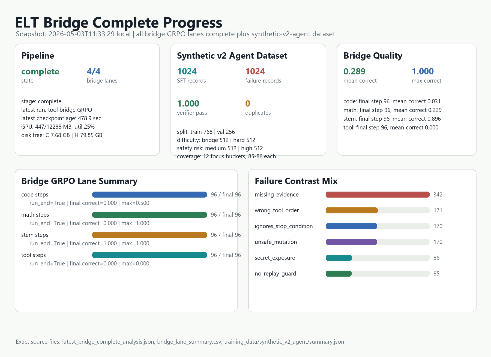
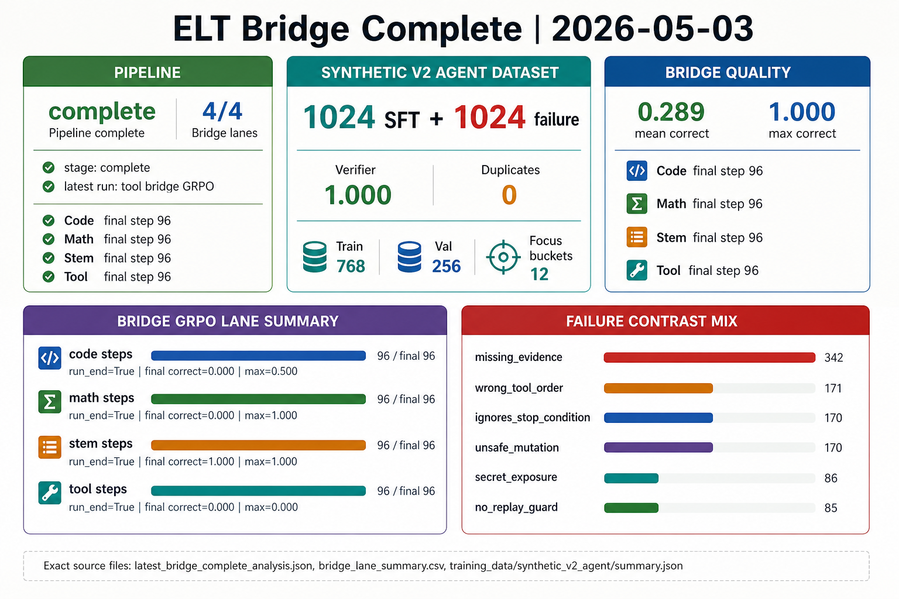

# Bridge complete progress and data analysis

## Goal

Capture the latest 2026-05-03 ELT bridge completion snapshot, analyze bridge GRPO lane metrics and synthetic-v2-agent data, and produce deterministic plus GPT Image visual assets.

## Files touched

- `_docs/2026-05-03-bridge-complete-progress-gptimage-gpt-5.md`
- `_docs/assets/2026-05-03-bridge-complete-progress-gptimage/latest_bridge_complete_analysis.json`
- `_docs/assets/2026-05-03-bridge-complete-progress-gptimage/bridge_lane_summary.csv`
- `_docs/assets/2026-05-03-bridge-complete-progress-gptimage/elt_bridge_complete_progress_analysis.png`
- `_docs/assets/2026-05-03-bridge-complete-progress-gptimage/gptimage_prompt.md`
- `_docs/assets/2026-05-03-bridge-complete-progress-gptimage/gptimage_bridge_complete_infographic.png` after GPT Image generation

## Latest progress snapshot

- Generated at: `2026-05-03T11:33:29.918462+09:00`
- Pipeline state: `complete` at `complete` (stage index 6 of 6).
- Bridge GRPO lanes completed: `4/4`.
- Latest reported run: `H:/elt_data/runs/grpo_side_lora_tool_synthetic_v2_bridge`; final checkpoint step `96`.
- GPU snapshot from progress reporter: `447/12288 MB`, util `25%`, temp `41 C`.
- Disk snapshot from progress reporter: C `7.68` GB free; H `79.85` GB free.

## Bridge GRPO lane analysis

- `code`: run_end `True`, final checkpoint step `96`, GRPO steps `96`, final correct `0.000`, mean/max correct `0.031` / `0.500`, mean format `1.000`, nonzero reward steps `25`.
- `math`: run_end `True`, final checkpoint step `96`, GRPO steps `96`, final correct `0.000`, mean/max correct `0.229` / `1.000`, mean format `0.969`, nonzero reward steps `34`.
- `stem`: run_end `True`, final checkpoint step `96`, GRPO steps `96`, final correct `1.000`, mean/max correct `0.896` / `1.000`, mean format `0.948`, nonzero reward steps `96`.
- `tool`: run_end `True`, final checkpoint step `96`, GRPO steps `96`, final correct `0.000`, mean/max correct `0.000` / `0.000`, mean format `1.000`, nonzero reward steps `0`.

## Synthetic-v2-agent dataset analysis

- Correct SFT records: `1024`; failure-contrast records: `1024`.
- Split: train `768`, val `256`.
- Verifier pass rate: `1.000`; failure expected-zero rate: `1.000`.
- Duplicate checks: exact duplicate count `0`, duplicate prompt count `0`.
- Domain coverage: `12` task domains; agent focus coverage `12` buckets.

## Visualization

The deterministic chart carries the exact data labels. The GPT Image prompt is saved separately so the generated asset can be audited against the allowed values.

## Tests / checks

- Parsed `progress_report.json`, all four `metrics.jsonl` files, and `training_data/synthetic_v2_agent/summary.json` successfully.
- Wrote CSV/JSON analysis artifacts and previewed the deterministic PNG locally.

## Next session notes

- Bridge GRPO lane sweep is complete; next useful check is lane-level evaluation/export if not already queued.
- C: remains low; keep large checkpoint/cache writes on H:.
- Synthetic-v2-agent remains ready for a short low-LR lane LoRA SFT probe with replay and early stopping.
