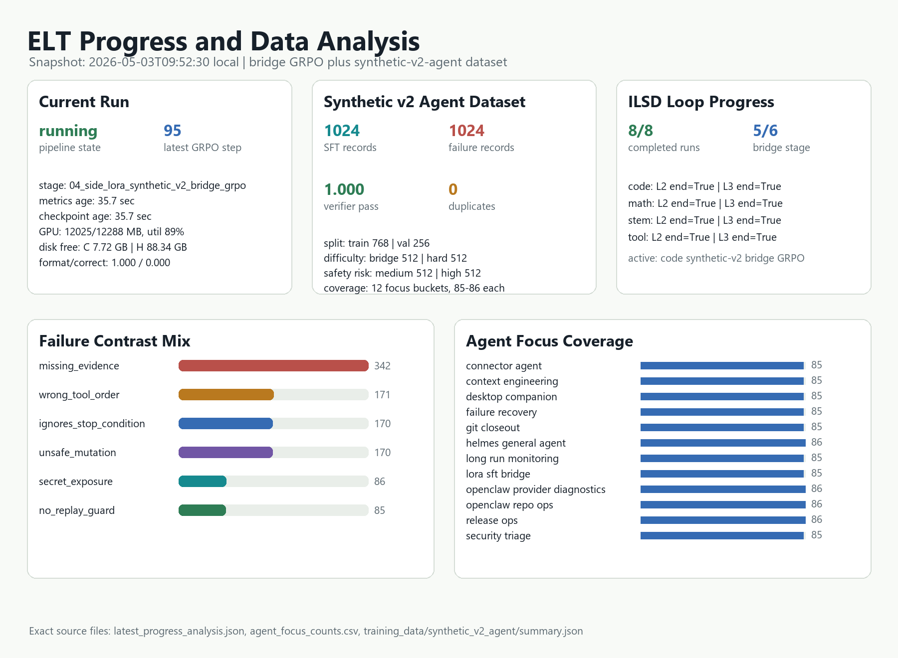
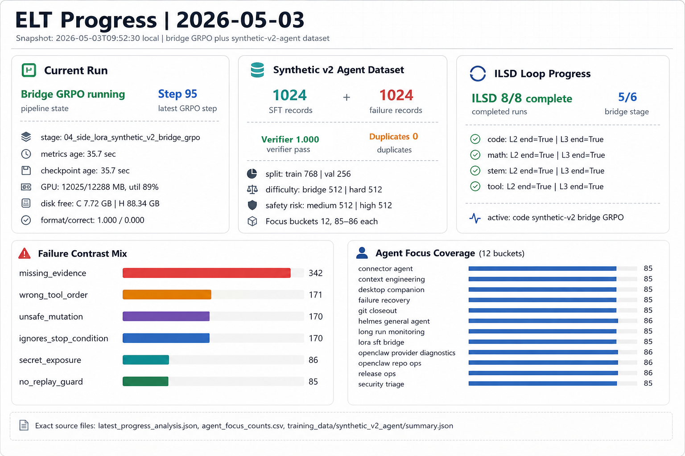

# Latest progress and data analysis

## Goal

Capture the 2026-05-03 ELT progress snapshot, analyze the newly generated synthetic-v2-agent dataset, and add a project-local visual summary suitable for GPT Image handoff.

## Files touched

- `_docs/2026-05-03-progress-data-analysis-gpt-5.md`
- `_docs/assets/2026-05-03-progress-data-analysis/latest_progress_analysis.json`
- `_docs/assets/2026-05-03-progress-data-analysis/agent_focus_counts.csv`
- `_docs/assets/2026-05-03-progress-data-analysis/elt_progress_data_analysis.png`
- `_docs/assets/2026-05-03-progress-data-analysis/gptimage_elt_progress_infographic.png`
- `_docs/assets/2026-05-03-progress-data-analysis/gptimage_prompt.md`

## Current progress snapshot

- Generated at: `2026-05-03T09:52:30.162304+09:00`
- Pipeline state: `running` at `04_side_lora_synthetic_v2_bridge_grpo` (stage index 5 of 6).
- Active bridge GRPO metrics: `H:\elt_data\runs\grpo_side_lora_code_synthetic_v2_bridge\metrics.jsonl`; latest parsed GRPO step `95`.
- Latest GRPO format/correct rates: `1.000` / `0.000`; latest loss `0.000541`; latest KL `0.000687`.
- GRPO nonzero-reward steps observed in current metrics: `25` of `96` parsed GRPO steps.
- Checkpoint age at analysis time: `35.7` sec; metrics age `35.7` sec.
- GPU snapshot from progress reporter: `12025/12288 MB`, util `89%`, temp `58 C`.
- Disk snapshot from progress reporter: C `7.72` GB free; H `88.34` GB free.

## Synthetic-v2-agent dataset analysis

- Correct SFT records: `1024`; failure-contrast records: `1024`.
- Split: train `768`, val `256`.
- Verifier pass rate: `1.000`; failure expected-zero rate: `1.000`.
- Duplicate checks: exact duplicate count `0`, duplicate prompt count `0`.
- Difficulty balance: `{'bridge': 512, 'hard': 512}`.
- Safety-risk balance: `{'medium': 512, 'high': 512}`.
- Domain coverage: `12` task domains, balanced `85` to `86` records each.
- Agent focus coverage: `12` buckets, balanced `85` to `86` records each.

## Visualization





The exact machine-readable snapshot is stored in `latest_progress_analysis.json`.
`elt_progress_data_analysis.png` is the deterministic local chart with exact
data labels. `gptimage_elt_progress_infographic.png` is the GPT Image variant
generated from `gptimage_prompt.md`, with the verifier value locally corrected
to `1.000`.

## Key decisions

- Kept the analysis artifacts under `_docs/assets/` so runtime files under `H:/elt_data` remain local-only.
- Treated progress reporter output as a snapshot, not a completion claim; the current bridge GRPO stage was still marked running.
- Used deterministic local plotting for exact numbers and saved a GPT Image prompt separately for presentation-grade rendering.

## Tests

```powershell
uv run --no-sync pytest tests/test_synthetic_v2_agent.py tests/test_synthetic_v2_hard.py tests/test_pipeline_orchestrator.py -q
```

Result: `54 passed`.

```powershell
uv run --no-sync python scripts/pipeline.py --profile synthetic-v2-agent --dry-run
```

Result: passed; dry-run plan contains `00_build_synthetic_v2_agent`.

```powershell
uv run --no-sync pytest -q
```

Result: full suite passed.

## Next session notes

- If bridge GRPO remains at zero correct rate after more nonzero-reward windows, inspect prompt/task mix before widening training.
- C: free space was low in the snapshot; keep large checkpoint/cache writes on H:.
- Agent data is ready for a short low-LR lane LoRA SFT probe with replay and early stopping before bridge GRPO.
